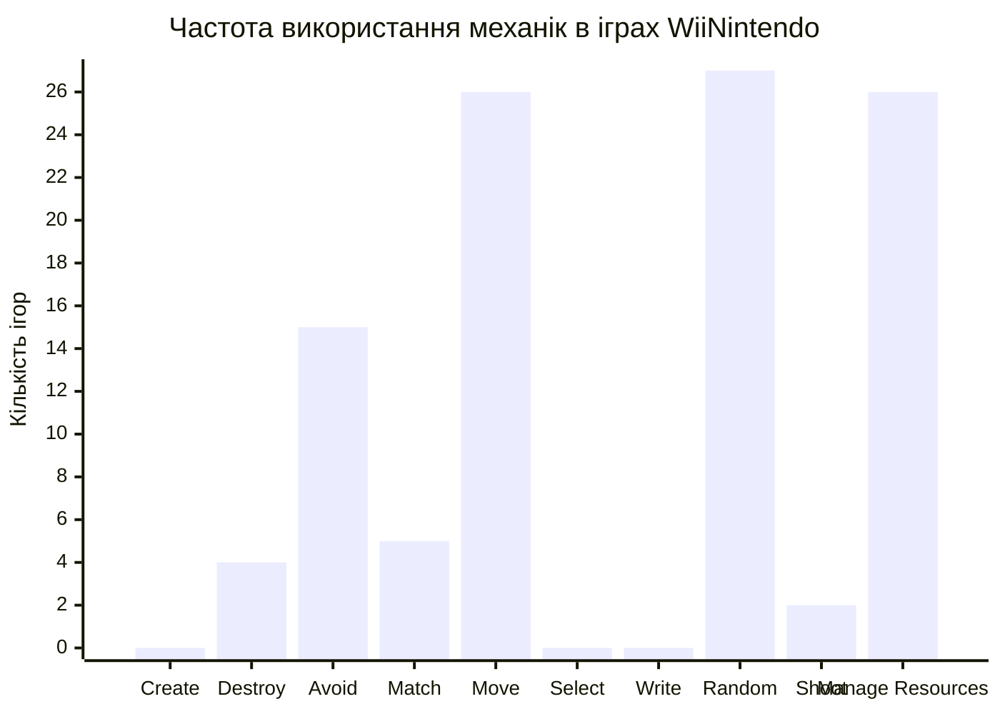
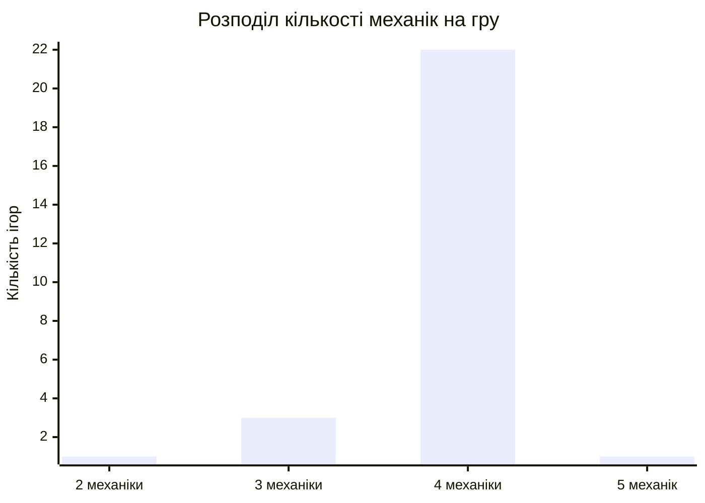

# 1. Описова статистика для WiiNintendo

Цей аналіз розглядає розподіл ігрових механік в іграх для WiiNintendo.

## Частота використання кожної механіки

Показує, скільки разів кожна ігрова механіка використовується в наборі з 27 ігор.

- **Move** (Рух), **Random** (Випадковість) і **Manage Resources** (Управління ресурсами) є основними механіками, присутніми майже в кожній грі.
- **Avoid** (Ухилення) є другою за популярністю механікою.
- **Create** (Створення), **Select** (Вибір) і **Write** (Письмо) не використовуються в жодній грі з цього набору.

| Механіка | Частота |
| :--- | :--- |
| Random | 27 |
| Move | 26 |
| Manage Resources | 26 |
| Avoid | 15 |
| Match | 5 |
| Destroy | 4 |
| Shoot | 2 |
| Create | 0 |
| Select | 0 |
| Write | 0 |

## Середня кількість механік на одну гру

Середня кількість механік, що припадає на одну гру, становить **3.89**.
Це свідчить про те, що ігри для WiiNintendo зазвичай поєднують кілька механік одночасно для створення ігрового процесу.

## Механіки, які найчастіше зустрічаються разом

Аналіз пар показує, які механіки найчастіше використовуються разом в одній грі. Найбільш поширені комбінації включають базові механіки, такі як `Random`, `Move` та `Manage Resources`.

| Пара механік | Кількість спільних появ |
| :--- | :--- |
| (Move, Random) | 26 |
| (Manage Resources, Random) | 26 |
| (Move, Manage Resources) | 25 |
| (Avoid, Move) | 15 |
| (Avoid, Random) | 15 |
| (Avoid, Manage Resources) | 15 |

## Heatmap (Гра × Механіка)

Нижче наведено таблицю, яка візуалізує наявність (`+`) або відсутність кожної механіки в кожній грі.

> Примітка: Мова Mermaid не підтримує складні теплові карти (heatmaps). Ця таблиця є текстовою альтернативою.

| Назва гри | Create | Destroy | Avoid | Match | Move | Select | Write | Random | Shoot | Manage Resources |
| :--- | :---: | :---: | :---: | :---: | :---: | :---: | :---: | :---: | :---: | :---: |
| Soccer Heading | | + | + | | + | | | + | | + |
| Ski Slalom | | | + | | + | | | + | | + |
| Table Tilt | | | | + | + | | | + | | + |
| Ski Jump | | | | | + | | | + | | + |
| Tightrope Walk | | | + | | + | | | + | | + |
| Balance Bubble | | | + | | + | | | + | | + |
| Penguin Slide | | + | | | + | | | + | | + |
| Snowboard Slalom | | | + | | + | | | + | | + |
| Lotus Focus | | | + | | | | | + | | + |
| Perfect 10 | | | | + | + | | | + | | + |
| Rhythm Kung Fu | | | | + | + | | | + | | + |
| Bird's-Eye Bull's-Eye | | | + | | + | | | + | | + |
| Snowball Fight | | | | | + | | | + | + | + |
| Obstacle Course | | | + | | + | | | + | | + |
| Tilt City | | | | + | + | | | + | | + |
| Trampoline Target | | | | | + | | | + | | + |
| Ultimate Obstacle Course | | | + | | + | | | + | | + |
| Core Luge | | | | | + | | | + | | + |
| Hosedown | | | + | | + | | | + | + | |
| Scuba Search | | + | | | + | | | + | | + |
| Climbing | | | + | | + | | | + | | + |
| Dessert Course | | | + | | + | | | + | | + |
| Big Top Juggling | | | + | | + | | | + | | + |
| Skateboard Arena | | | + | | + | | | + | | + |
| Table Tilt Plus | | | | + | + | | | + | | + |
| Balance Bubble Plus | | | + | | + | | | + | | + |
| Segway Circuit | | + | | | + | | | + | | + |

## Розподіл кількості механік на гру

Переважна більшість ігор (22 з 27) використовують 4 механіки.

> Примітка: Мова Mermaid не підтримує діаграми типу "boxplot". Натомість для візуалізації розподілу використовується стовпчикова діаграма.

